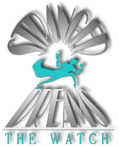
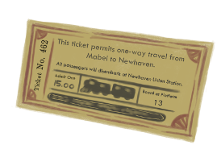

# Stranger Dreams: The Watch

ActionScript source code for a point-and-click, graphic adventure game.

Code is provided for historical/educational purposes only - the last revision was made in 02/2012.

## About

Stranger Dreams: The Watch was a game created in 2012 and presented during the 2012 IUPUI Media Arts & Sciences Capstones. All artworks and illustrations were created by [Jackie Crofts](http://jackiecrofts.com). Programming and sound design by [Dean Verleger](https://github.com/deanbot). Stranger Dreams was co-written and produced by Jackie and Dean.

The game was never developed past a small beta version including a tutorial and an opening chapter.

Website: [coming soon]

## Play it!

Play (with Adobe Air) at [coming soon].

Instructions:
  * At "Station" use code "Mabel & Waning Range Station"
  * See on page instructions for downloading & installing Adobe Air and Stranger Dreams: The Watch

